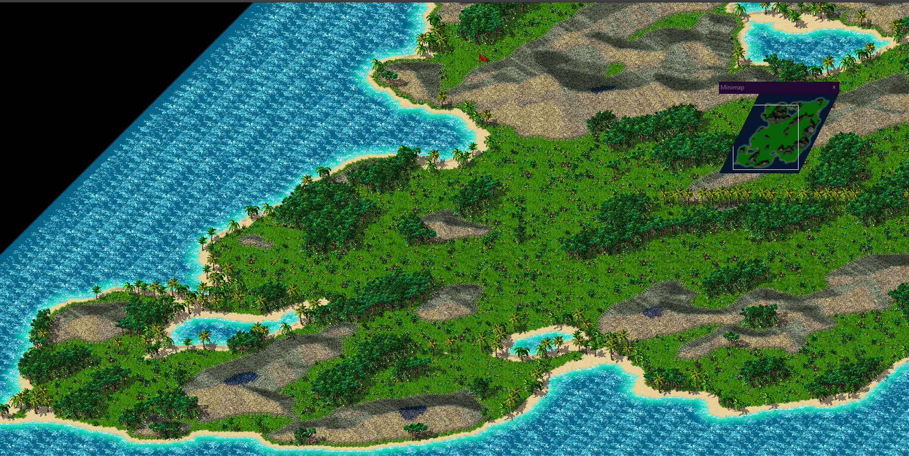

# S4RandomMapGenPlus
Custom MapGenerator.dll for S4Editor / Settlers IV GE
Very early, kind of playable. To be playable, it is missing:
- start pos 
- hills/mud/flower fields/desert
- a lot more cool features (e.g. biomes, different tree groups)

Adjustments to map generation (e.g. too many forests, too small plains between mountains) will be done once it is playable.

# Got Ideas? 
[Leave them here :3](https://github.com/MuffinMario/S4RandomMapGenPlus/issues)

# Enjoy pictures while I work on it

